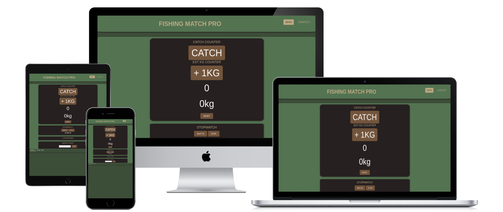
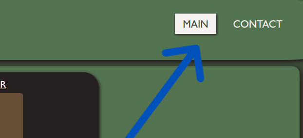
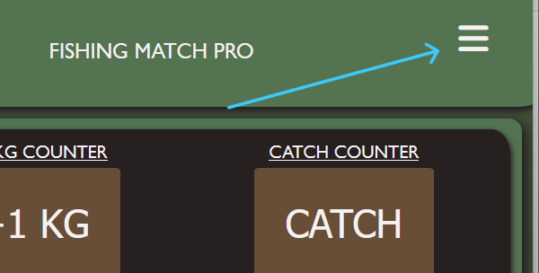
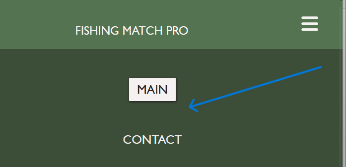
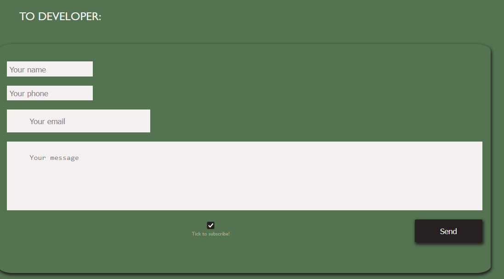
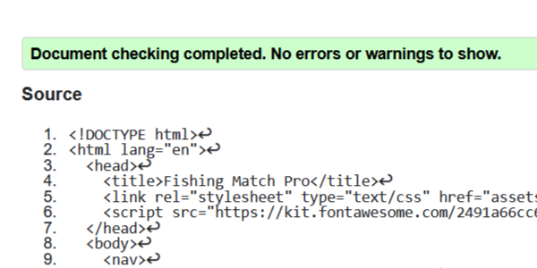
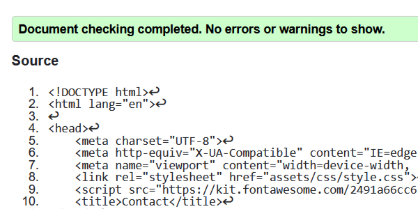
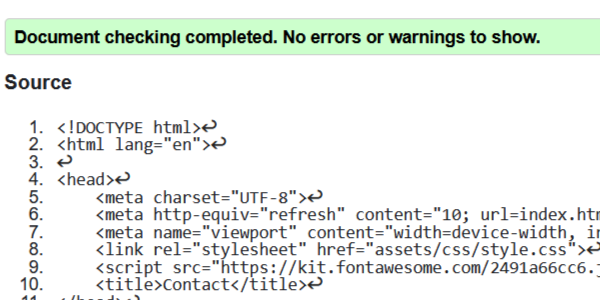
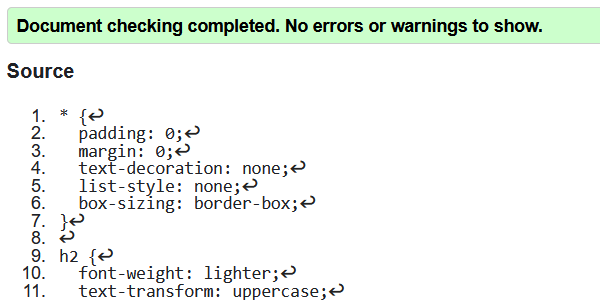
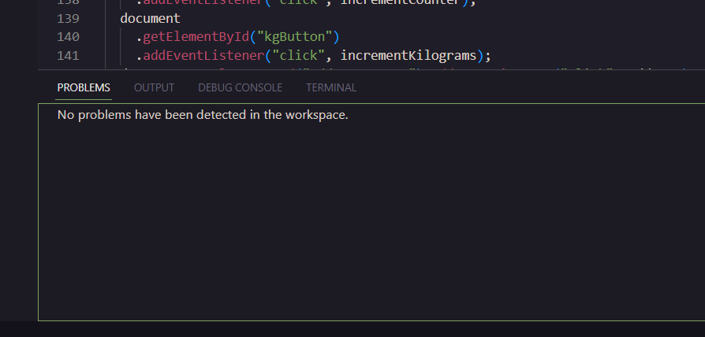

# Fishing Match Pro website

## Web application for anglers

&nbsp;

The Fishing Match Pro website is a beta version before application.

Click [here](https://sandorgyorfi.github.io/Fishing-Match-Pro/) to visit the live page.

&nbsp;

# Features

&nbsp;

A standard fishing match has a few items and data is quite crucial. The timing of baits, the kilogramme amounts in keep nets, and the time gap between catches are all important considerations. All three of them are aided by the Fishing Match Pro, which also includes a note option.

On each page, there are two menu options: the main menu, which has information about the web application, and the contact menu, which contains information about contacting the developer if any problems emerge.

 
&nbsp;

## Existing Features

&nbsp;

# User Experience

Click [here](assets/images/wireframe.png) to visit the wireframe sample.

- The Fishing Match Pro online application is a creative option for fishermen who want to employ tiny multifunctional fishing instruments.

&nbsp;

### Navigation Bar:

&nbsp;

- The entire responsive navigation bar is featured on both pages and includes links to all menus and is same in each page to allow for easy navigation.
- This section will allow the user to simply go from page to page across all devices without having to use the 'back' button to return to the previous page.

  
&nbsp;

### Desktop Navigation view

  
&nbsp;

  
  
  
  
&nbsp;

### Transition To Hamburger Menu Automatically _(when changes accured in the page size)_

  
&nbsp;

  

  
&nbsp;

### And Transitioning The Menu

  
&nbsp;

  

  
&nbsp;

- **The main page**

  - The main window comprises texts, a stopwatch, a clicker counter, an estimated kilogramme counter, a list of lap times with time differences, a note option, and a reset button.
  - This portion is useful for anglers who have never participated in any fishing tournaments.

  
&nbsp;

- **Contact section**

  - The contact section will allow the user to contact with the Fishing Match Pro developer and also give a possibility to subscribe with a check button

  
&nbsp;

 

 
&nbsp;

# The Footer

- The footer section states that all rights to the website's content are reserved.
- The designer's initials are also included.

 
&nbsp;

# Testing

&nbsp;

The website was tested on all standard device settings and all type of standard browsers as well.

It is a fully responsive and automated website and it’s catching up with all standard different sizes.

The website also been tested for deceptive persons, to make the visibility 100%

&nbsp;

## Validator Testing

&nbsp;

### HTML:

&nbsp;

No errors were found when passing through the official (http://validator.w3.org)

 
&nbsp;

### Main Page HTML Validation:

&nbsp;

&nbsp;

### Contact Page HTML Validation:

&nbsp;

&nbsp;

### Manual and Subscribed Page HTML Validation:

&nbsp;

&nbsp;

### CSS:

- Also no errors returned when passing through the official (http://validator.w3.org)

&nbsp;

&nbsp;

### JavaScript:

-Furthermore, no errors were returned upon passing through the official (https://code.visualstudio.com/)

&nbsp;

&nbsp;

&nbsp;

# Deployment

- The site was deployed to GitHub pages through GitHub Desktop from VS Code.

* Commit created via GitHub Desktop
* Pushed to origin via GitHub Desktop
* checked on GitHub pages

- Link can be found here:
  https://sandorgyorfi.github.io/Fishing-Match-Pro/

 
&nbsp;

## Future Features

- A new menu will be created, which will be a social networking platform menu where fishermen may post their incredible catches.
- There will also be a submenu on the main page. There will be a bait advisor system to provide outstanding bait alternatives according on the weather.
- Merchandise shop will follow 

 
&nbsp;

## Languages used

 
&nbsp;

- [HTML5](https://en.wikipedia.org/wiki/HTML)
- [CSS](https://en.wikipedia.org/wiki/CSS)
- [JavaScript](https://en.wikipedia.org/wiki/JavaScript)

 
&nbsp;

# Feedback reports from users:

An anonymous user requested the ability to take notes while fishing. A notes card was added to the page by the developer.

-An anonymous user with deuteranopia requested a colour modification. - Colours have been changed by the developer.

-An anonymous user asked for instructions on how to use the main page. - Developer added a manual page.

-Laszlo, a user, wanted an angler webshop. In version 3.0, the developer plans to include a webshop.

&nbsp;

## Reporting doubts and errors

-Fore any queries please send an email at mr.sandorgyorfi@gmail.com

-Please refer to the publication for detailed results and model performances

&nbsp;

# Credits

- All the codes written by Sandor Gyorfi

&nbsp;

# Content:

- All the codes written by Sandor Gyorfi
